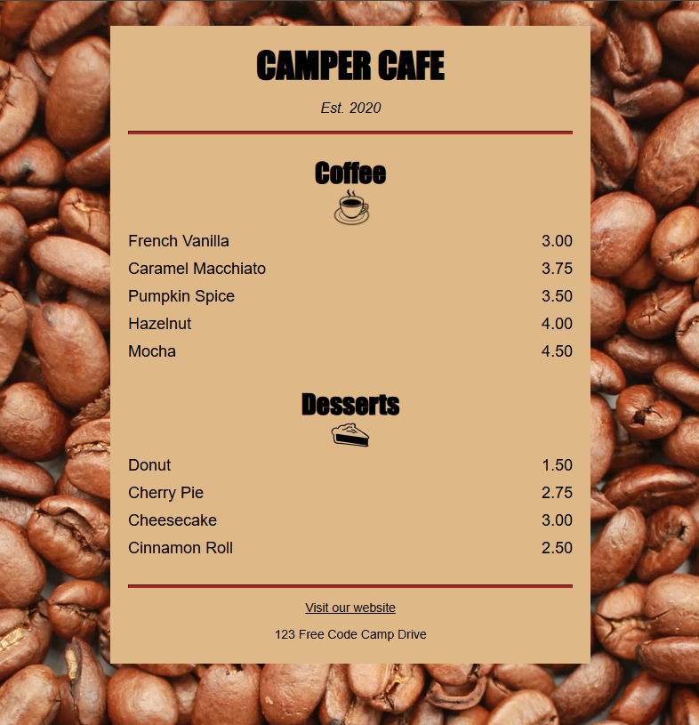

# Cafe Menu Webpage ☕🍰

This is a simple, responsive cafe menu webpage built using HTML and CSS.  
The project is part of my web development learning journey to practice layout design, styling, and responsive techniques.

## 🔧 Technologies Used

- HTML5  
- CSS3 (including Flexbox/Grid for layout and styling)

## 📂 Project Structure

cafe-menu/
├── index.html
└── style.css

## 🖼️ Preview

## 📌 Features

- Clean, modern design inspired by real cafe menus  
- Responsive layout that works on desktop and mobile  
- Use of semantic HTML elements for better accessibility  
- External CSS stylesheet for styling  

## 👩‍💻 Learning Outcomes

- Practiced linking external CSS file to HTML  
- Understood CSS selectors, properties, and responsive design basics   
- Improved attention to UI detail and design consistency

## 👤 Author

Made by Mehul  
[GitHub Profile](https://github.com/mehul-raj-garg)
